📱 Android Development Internship – OIBSIP

This repository contains the Android applications developed as part of my Android Development Internship at OIBSIP.

🚀 Tasks Completed

- 📏 Task 1 – Unit Converter
- 📝 Task 2 – To-Do App
- 🧮 Task 3 – Calculator
- ⏱️ Task 4 – Stopwatch

---

📏 Task 1 – Unit Converter

A simple Android Unit Converter application that allows users to convert different types of units.

✨ Features

- Length conversion
- Temperature conversion
- Weight conversion
- Input validation
- Invalid or null input handling
- Simple and user-friendly interface

📸 Screenshots

🏠 Home

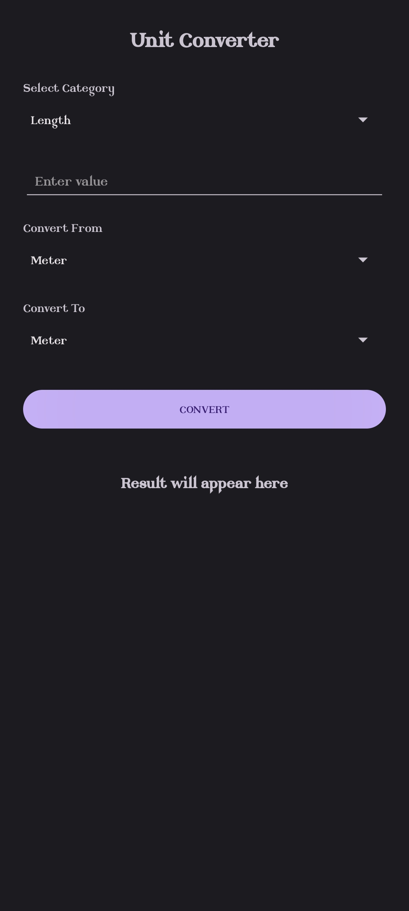

📏 Length

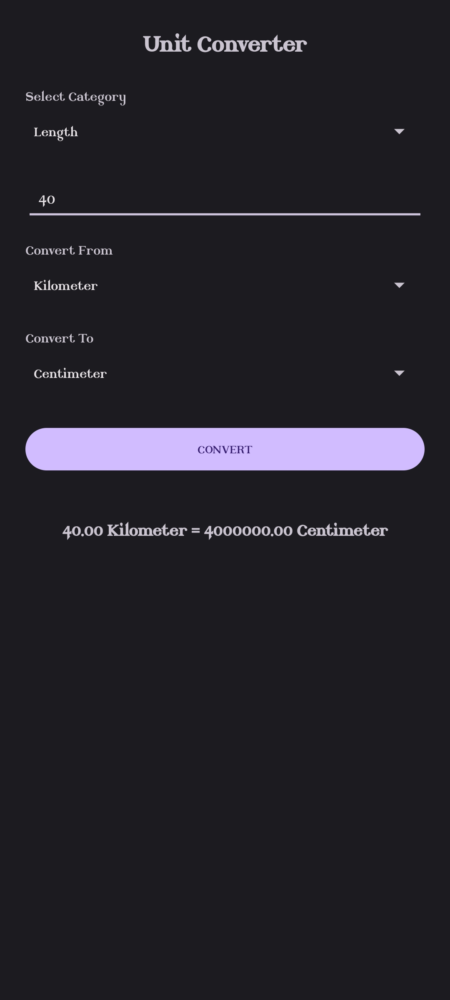

🌡️ Temperature

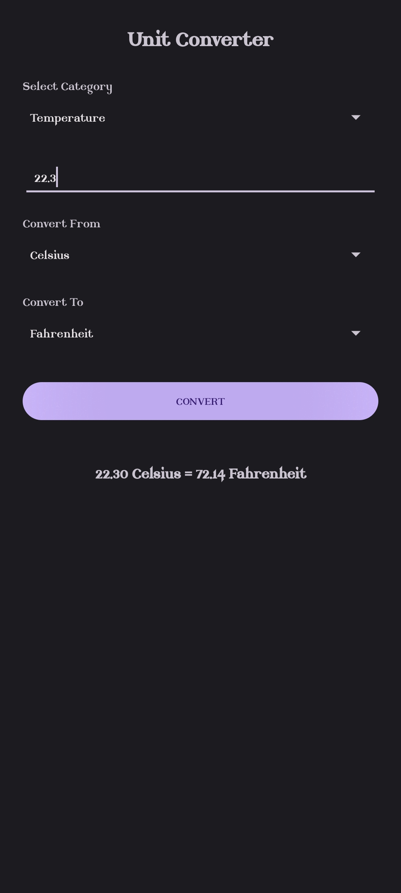

⚖️ Weight

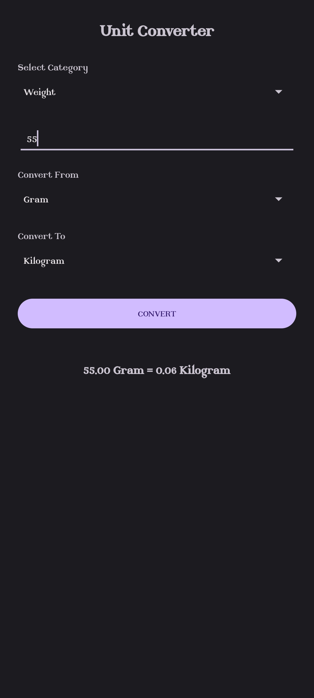

⚠️ Invalid or Null Input

---

📝 Task 2 – To-Do App

A To-Do application that allows users to create an account, log in, manage tasks, complete tasks, and log out.

✨ Features

- User registration
- User login
- Add tasks
- View tasks
- Complete tasks
- Task management
- Logout functionality
- SQLite database for storing users and tasks

📸 Screenshots

👤 Create Account

🔐 Login

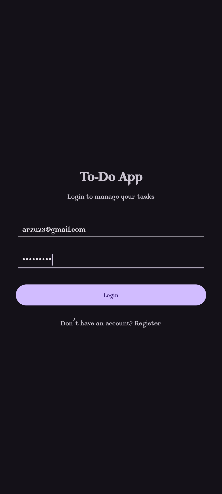

🏠 Main Page

📝 Task After Login

📝 Added Tasks

✅ Completing Task

🚪 Logout Successful

---

🧮 Task 3 – Calculator

A simple Android Calculator application that performs basic arithmetic operations with error handling.

✨ Features

- Addition
- Subtraction
- Multiplication
- Division
- Error handling
- Simple calculator interface

📸 Screenshots

🏠 Home

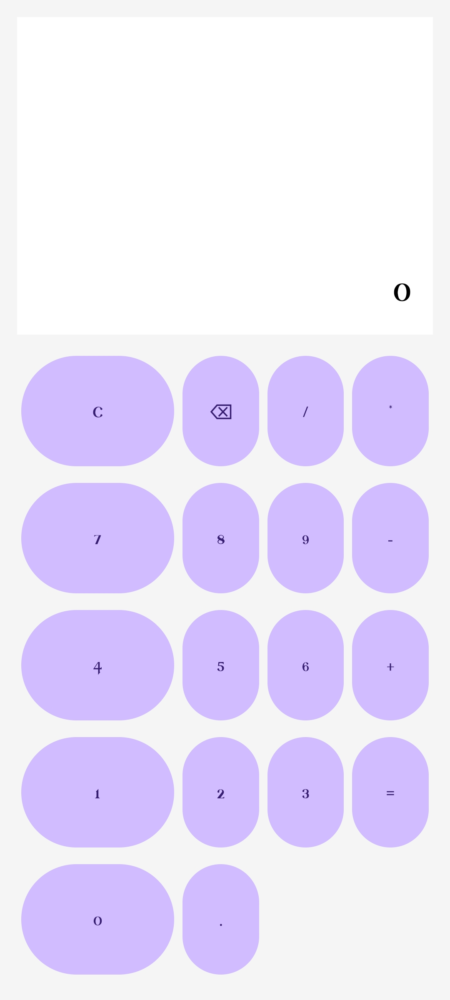

➕ Addition

➖ Subtraction

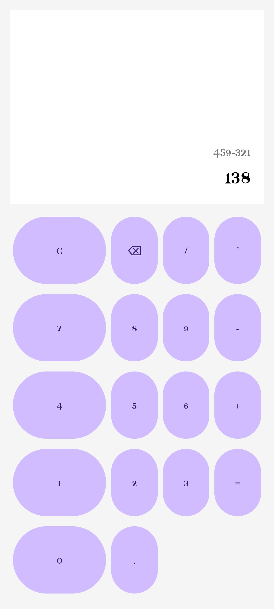

✖️ Multiplication

➗ Division

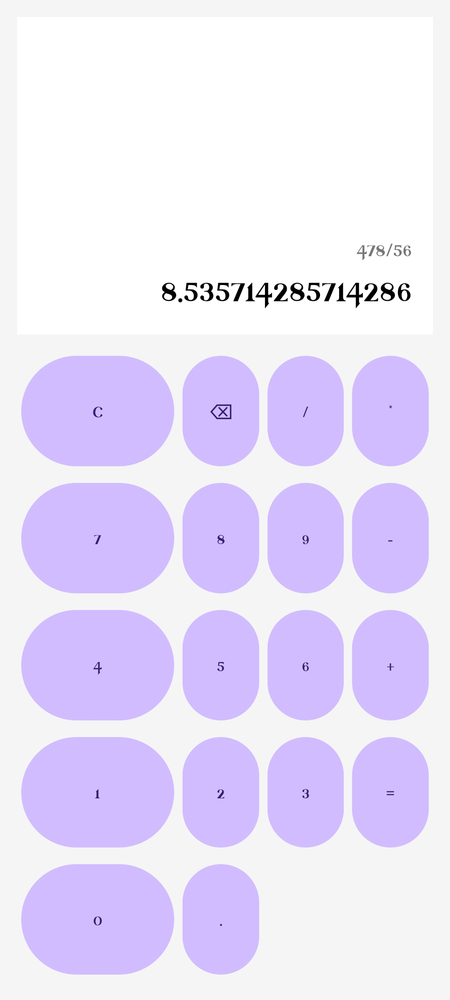

⚠️ Error

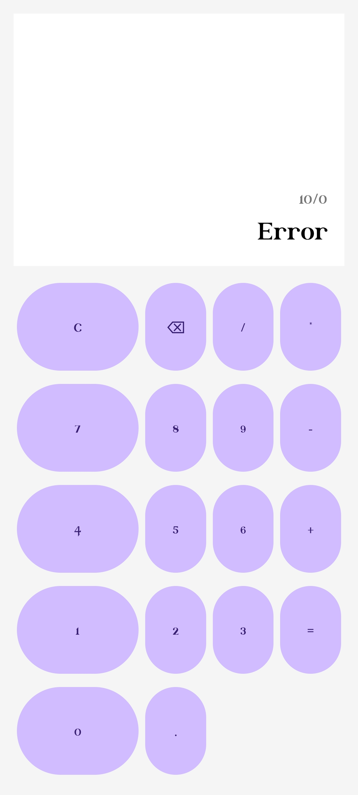---

⏱️ Task 4 – Stopwatch

A simple Android Stopwatch application that allows users to measure elapsed time and record lap times.

✨ Features

- Start stopwatch
- Stop stopwatch
- Reset stopwatch
- Record lap times
- Simple and user-friendly interface

📸 Screenshots

🏠 Main Page

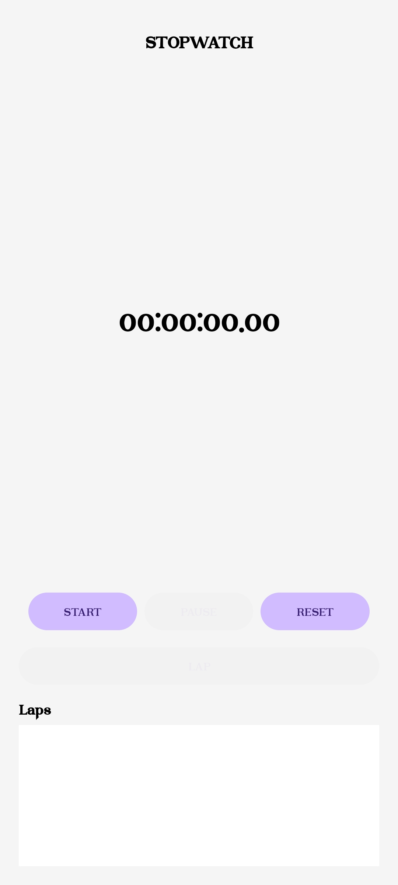

🏁 Laps

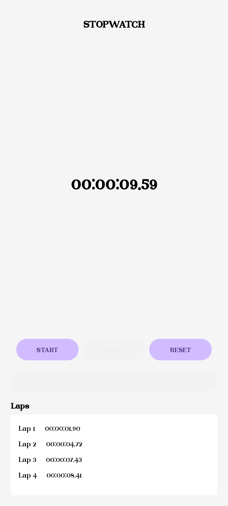---

🛠️ Technologies Used

- Java
- XML
- Android Studio
- SQLite
- Git
- GitHub

---

---

👩‍💻 Author

Saniya Banu

AIML Engineering Student
Malnad College of Engineering
